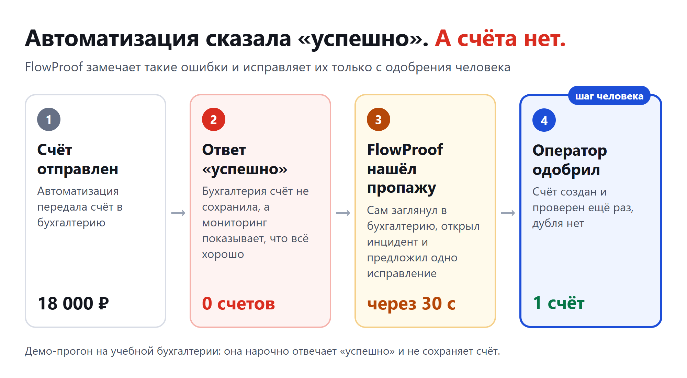
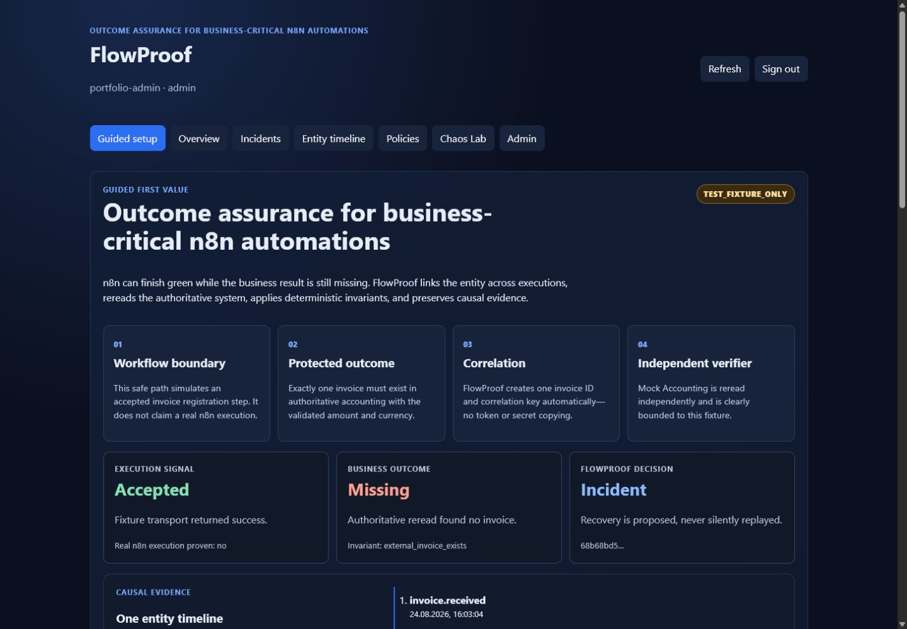

# FlowProof

Проверяет, что автоматизация довела дело до конца. Сценарий в n8n может закончиться статусом «успешно», хотя счёт в бухгалтерию так и не попал. FlowProof сам сверяется с бухгалтерией, открывает инцидент и исправляет пропажу после одобрения человека.



**Кому.** Командам, у которых счета, оплаты и заявки проходят через n8n или похожие автоматизации.

**Как сделано.** Код написали ИИ-агенты OpenAI Codex и ChatGPT по моей постановке. Я ставил задачи, проверял результат и принимал работу.

**Что проверено.** 252 теста бэкенда прошли, 3 теста блокировки файла пропущены на Windows. Проверка кода и сборка панели прошли. Учебный сценарий за 39 секунд дошёл от ложного ответа «успешно» до ровно одного счёта после одобрения человека.

## Что умеет

- Принимает события из автоматизации: счёт получен, проверен, одобрен, отправлен в бухгалтерию.
- Сверяет их с правилами из YAML: счёт появился в бухгалтерии один раз, на ту же сумму и в срок.
- Сам проверяет бухгалтерию по API. Ответ «успешно» от автоматизации для него ничего не доказывает.
- Открывает инцидент с доказательствами: что ожидалось, что нашлось, какая сумма затронута.
- Предлагает одно исправление и выполняет его только после одобрения оператора. Потом проверяет бухгалтерию ещё раз. Повторный запуск исправления дубль не создаёт.
- Панель оператора: инциденты, история каждого счёта, правила, учебные сбои бухгалтерии.
- Четыре готовых сценария n8n и выгрузка доказательств в архив с проверкой целостности.
- Учебный режим для первого знакомства и отдельную проверку Xero Demo Company только на чтение. Для Xero каждый пользователь вводит собственный Client ID; запись в Xero не реализована.
- Исходники Windows-пакета с хранением данных в папке выбранного пользователя. Готовый установочный ZIP в этом репозитории не приложен.

<details>
<summary>Кадр панели v0.6.0 в учебном режиме (интерфейс на английском)</summary>

Сверху показан результат автоматизации, ниже — отдельная проверка результата и инцидент. На кадре явно указан учебный режим.



</details>

## Запуск без Docker

Нужны Python 3.12, Git Bash на Windows (или Bash на Linux/macOS) и Node.js 22 для панели. Команды выполняются из корня репозитория в одном терминале. База хранится локально в игнорируемой папке `.venv`. На этой машине сценарий проверен с Python 3.13.7; заявленный диапазон проекта — Python 3.12.

```bash
python -m venv .venv
case "$OSTYPE" in
  msys*|cygwin*) source .venv/Scripts/activate;;
  *) source .venv/bin/activate;;
esac
pip install -r backend/requirements.lock

export PYTHONPATH=backend/src
DB_ROOT="$(pwd)"
case "$OSTYPE" in msys*|cygwin*) DB_ROOT="$(pwd -W)";; esac
export FLOWPROOF_DATABASE_URL="sqlite:///$DB_ROOT/.venv/flowproof-demo.db"
export FLOWPROOF_TOKEN_PEPPER="$(python -c 'import secrets; print(secrets.token_urlsafe(48))')"
export FLOWPROOF_MOCK_ACCOUNTING_URL=http://127.0.0.1:8001
export FLOWPROOF_CORS_ORIGIN=http://127.0.0.1:5173

(cd backend && python -m alembic upgrade head)
(cd mock-accounting && python -m uvicorn app.main:app --host 127.0.0.1 --port 8001) >.venv/mock.log 2>&1 & mock_pid=$!
python -m uvicorn flowproof.main:app --host 127.0.0.1 --port 8000 >.venv/api.log 2>&1 & api_pid=$!
python -m flowproof.scheduler >.venv/scheduler.log 2>&1 & scheduler_pid=$!
trap 'kill "$mock_pid" "$api_pid" "$scheduler_pid" 2>/dev/null || true' EXIT INT
for i in $(seq 1 30); do
  curl -fsS http://127.0.0.1:8000/health >/dev/null 2>&1 &&
  curl -fsS http://127.0.0.1:8001/health >/dev/null 2>&1 && break
  sleep 1
done
curl -fsS http://127.0.0.1:8000/health >/dev/null &&
curl -fsS http://127.0.0.1:8001/health >/dev/null || exit 1
```

Введите временный пароль администратора. Токен для учебных событий создаётся локально и не выводится в терминал:

```bash
export FLOWPROOF_DEMO_ADMIN_NAME=admin
read -rsp 'Временный пароль администратора: ' FLOWPROOF_DEMO_ADMIN_PASSWORD; echo
export FLOWPROOF_DEMO_ADMIN_PASSWORD
printf '%s\n' "$FLOWPROOF_DEMO_ADMIN_PASSWORD" | python -m flowproof.identity bootstrap-admin --name admin --password-stdin

PRINCIPAL_ID=$(python -m flowproof.identity create-service-account --name demo-events --scope events:write \
  | tail -n 1 | python -c 'import json, sys; print(json.load(sys.stdin)["principal"]["id"])')
export FLOWPROOF_DEMO_EVENT_TOKEN=$(python -m flowproof.identity issue-token --principal-id "$PRINCIPAL_ID" \
  --scope events:write --expires-in-seconds 3600 | tail -n 1 | python -c 'import json, sys; print(json.load(sys.stdin)["token"])')
```

Демо:

```bash
FLOWPROOF_API_URL=http://127.0.0.1:8000/api/v1 MOCK_ACCOUNTING_URL=http://127.0.0.1:8001 python scripts/demo.py
```

В конце должны быть `"final_incident_status": "resolved"`, `"final_recovery_status": "verified"` и `"mock_invoice_count": 1`. Проверенный прогон v0.6.0 занял 39 секунд и использовал счёт на 18 000 ₽.

Чтобы открыть панель, оставьте тот же терминал работающим:

```bash
(cd frontend && npm ci && VITE_FLOWPROOF_API_URL=http://127.0.0.1:8000/api/v1 npm run dev -- --host 127.0.0.1 --port 5173 --strictPort)
```

Откройте http://127.0.0.1:5173 и войдите как `admin` с введённым паролем. Остановите панель через Ctrl+C: запущенные в этом терминале сервисы тоже завершатся. Документация API: http://127.0.0.1:8000/docs.

## Запуск в Docker

Для учебного сценария нужны Docker Desktop с Compose v2 и PowerShell. Скрипт создаёт временные учётные данные, поднимает отдельный набор контейнеров, проверяет сценарий и затем удаляет его:

```powershell
.\scripts\run_false_200_docker_smoke.ps1
```

Для длительной работы сервисов и настройки своей среды используйте [руководство по развёртыванию](docs/DEPLOYMENT_RUNBOOK.md). Сценарий с n8n описан в [руководстве по демо](docs/DEMO_SCRIPT.md).

## Windows-пакет

В `productization/windows/` лежат код установщика и инструкция. Сам манифест помечен `DEVELOPMENT_UNBUILT`: готового ZIP с Docker-образами здесь нет. Сборка такого ZIP требует Docker; отдельной проверки на чистом Windows-компьютере пока не было. Для знакомства с проектом используйте проверенный запуск без Docker выше.

## Тесты

```bash
export PYTHONPATH=backend/src
python -m pytest backend/tests
python -m ruff check backend/src backend/tests
python scripts/check_version_consistency.py
python scripts/check_release_status.py
python scripts/validate_workflows.py
python scripts/check_action_pins.py
cd frontend && npm ci && npm run lint && npm run build
```

На Windows три теста блокировки файла штатно пропускаются: они требуют Linux/POSIX. GitHub Actions пока запускаются вручную.

## Стек

- Бэкенд: Python 3.12, FastAPI, SQLAlchemy 2, Alembic, Pydantic 2, PostgreSQL или SQLite, отдельный планировщик сроков.
- Панель: React 19, Vite 6, TypeScript.
- Автоматизация: n8n, четыре сценария в `workflows/`.
- Учебная бухгалтерия: FastAPI с режимами сбоев (ответ «успешно» без сохранения, таймаут, запись с задержкой, неверная сумма).
- Развёртывание: Docker Compose, Caddy, скрипты установки, резервной копии и отката.

## Ограничения

- Полный сценарий исправления проверен с учебной бухгалтерией. Xero Demo Company подключается только для проверки на чтение; реальная запись и исправление в Xero не реализованы.
- Исправление одно: зарегистрировать пропавший счёт.
- Интерфейс панели на английском, автотестов у панели нет.
- На экране Overview сумма считается по каждому открытому инциденту. Если на один счёт открыто два инцидента, сумма удваивается.
- Windows-пакет пока не собран и не подписан. Проверка установки на другом компьютере остаётся открытой.

Полный список: [docs/KNOWN_LIMITATIONS.md](docs/KNOWN_LIMITATIONS.md). Устройство системы: [docs/ARCHITECTURE.md](docs/ARCHITECTURE.md).

## In English

FlowProof checks business outcomes of workflow automations. When n8n reports success but the invoice never reached the accounting system, FlowProof detects it through an independent check, opens an evidence-backed incident and runs a single human-approved recovery, then verifies the result. The code was written by AI agents (OpenAI Codex, ChatGPT) under my direction; I set the tasks, reviewed and accepted the work.

Лицензия MIT.
