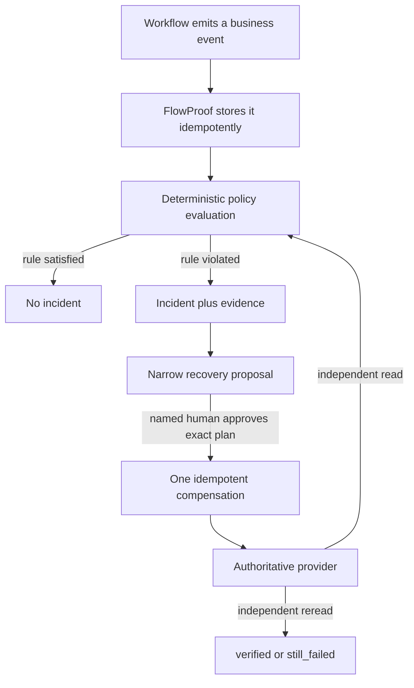
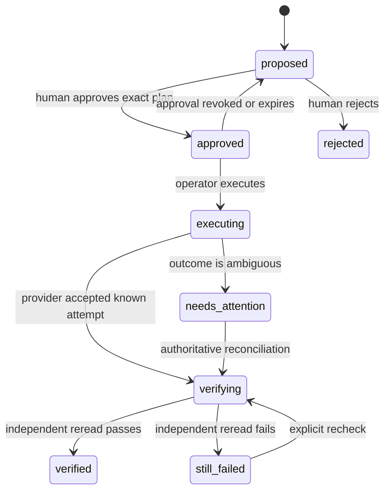

# FlowProof in plain English

This document explains the project for a reader who does not already know
FastAPI, n8n, idempotency, state machines, or accounting integrations.

For the Russian version, see [FLOWPROOF_EXPLAINED_RU.md](FLOWPROOF_EXPLAINED_RU.md).

## 1. What is FlowProof?

FlowProof checks whether an automation produced the business result that it was
supposed to produce.

That is different from checking whether the automation process itself finished.
For example, n8n can show a green execution because an HTTP request returned
`200 OK`. The external accounting system may still have stored nothing. The
transport succeeded, but the business operation failed.

FlowProof watches the business process after the workflow engine:

1. It receives small, safe business events.
2. It groups events that belong to the same operation.
3. It evaluates explicit rules.
4. When necessary, it independently reads the authoritative external system.
5. It opens an incident with machine-readable evidence when a rule is broken.
6. It prepares a narrow, allowlisted recovery action.
7. A human must approve that exact action.
8. FlowProof executes it once and rereads the external system.
9. Only the reread may prove that the incident is resolved.

## 2. A delivery analogy

Imagine a parcel delivery application.

- The courier application says: “request sent successfully.”
- The delivery company answers: “request accepted.”
- But the parcel never appears in the company’s tracking system.

A normal technical monitor sees two successful requests. FlowProof asks the
business question: “Does parcel 123 actually exist in the authoritative
tracking system?”

If it does not exist, FlowProof records what happened, asks a human for
permission to perform one safe registration, then checks the tracking system
again. It never declares success merely because the repair request returned
another green HTTP response.

## 3. The main flow



The important separation is:

- the workflow engine reports execution state;
- the provider is the source of truth for the external object;
- FlowProof evaluates the business invariant and controls recovery;
- a human owns the recovery decision.

## 4. Why the checks are deterministic

A deterministic check gives the same result for the same facts. It is code,
not a language-model opinion.

Examples:

- “A `payment_completed` event must follow `payment_started`.”
- “Exactly one invoice with this ID must exist.”
- “The provider amount must equal the event amount.”
- “The invoice must appear within 60 seconds.”

Optional AI may summarize an incident for a person. AI cannot decide whether
an invariant passed, approve a recovery, perform a write, or resolve an
incident.

## 5. Rule types

### `ordering`

Checks that events happened in the required order.

### `exactly_once`

Checks that the expected event or external object exists once, not zero times
and not twice.

### `eventually`

Allows a result to appear within a deadline. Before the deadline the result is
pending. After the deadline a missing result is a violation.

### `value_matches`

Compares important values such as amount, currency, customer, or status.

### `external_assertion`

Uses an independent provider read to verify the authoritative result. A
successful workflow response is not used as proof of the provider state.

## 6. The main data objects

### Event

A small fact such as “invoice processing started” or “workflow reported
completion.” An event has an idempotency key, correlation ID, entity ID,
timestamp, source, and bounded payload.

### Entity

The business object being followed: an invoice, payment, ticket, order, or
another object.

### Correlation

The ID that connects events, checks, incidents, and recovery for one business
operation.

### Policy and invariant

A policy is a versioned set of rules. An invariant is one rule inside it.

### Observation

A normalized result of reading an external provider. It records enough proof
for a decision without storing an unlimited raw provider response.

### Incident

A durable record that an invariant was violated. It contains status, summary,
identity, and machine-readable evidence.

### Recovery plan

An immutable proposal for one allowlisted compensation. It is bound to the
incident, exact parameters, provider contract, guardrails, and plan hash.

### Recovery decision

The audit record showing who approved, rejected, or revoked the plan and when.

### Recovery attempt

The durable execution ledger for the compensation. It prevents a transport
retry from silently creating a duplicate side effect.

### Evidence capsule

A sanitized, machine-readable export of the relevant facts and provenance.

## 7. Idempotency without magic

Idempotency means that repeating the same request does not repeat the business
effect.

FlowProof uses it in two places:

1. Event ingestion: the same key and same content is a safe replay. The same key
   with different content is a conflict and fails closed.
2. Recovery: the side-effect key is reserved before dispatch. A retry can
   reconcile the known attempt instead of blindly writing again.

This matters because networks fail at awkward moments. A provider may accept a
write while the caller loses the response. Automatic “try again” logic could
create a duplicate invoice. FlowProof records ambiguity and asks for an
authoritative reconciliation instead.

## 8. Incident states

The central incident path is:

```text
open -> recovery proposed -> recovery in progress -> resolved
```

Important alternatives include:

- no recovery exists: the incident remains visible for manual handling;
- approval is rejected or revoked: no write is performed;
- the provider still does not satisfy the rule: the incident remains open;
- the recovery outcome is ambiguous: automatic repetition stops.

An incident is resolved only after independent verification.

## 9. Recovery states



Approval is not a generic “do repairs” permission. It is tied to the current
incident state and exact plan hash. If the plan changes, the old approval is no
longer sufficient.

## 10. Project components

### Backend

`backend/src/flowproof/` contains the domain behavior:

- service and policy evaluation;
- persistence models and repositories;
- incidents and evidence;
- deadline scheduler;
- identity, sessions, service credentials, and audit;
- provider adapters;
- recovery planning, execution, and verification;
- the FastAPI HTTP boundary.

HTTP handlers are intentionally thin. Business transitions live in services so
they can be tested without a browser.

### Frontend

`frontend/` is the React/Vite operator dashboard. It shows incidents,
timelines, evidence, approval controls, recovery attempts, and the explicit
fixture/Xero qualification boundaries.

The browser does not decide business truth. It calls the API and displays the
server-owned state.

### n8n workflows

`workflows/` contains importable workflow JSON. The workflow emits business
events and invokes narrow actions; FlowProof does not replace the n8n editor or
become a general workflow control plane.

### Mock Accounting

`mock-accounting/` is an explicit `TEST_FIXTURE_ONLY` service. It can return
`200 OK` while intentionally storing nothing. That controlled failure proves
the FlowProof state machine; it is not presented as a real accounting system.

### Specifications

`specs/` contains OpenAPI, provider contracts, outcome packs, policy examples,
and evidence schemas. These files make public interfaces reviewable and
machine-checkable.

### Windows productization

`productization/windows/` contains the local appliance controller, manifests,
packaging logic, and guided n8n connection flow. The portfolio asset is
unsigned and independent fresh-Windows verification remains a separate proof
axis.

### Verification and release files

`scripts/`, `quality/`, `release/STATUS.json`, `NIGHTLY_REPORT.md`, and the
status documents keep executable checks separate from claims.

## 11. Database and migrations

The normal container stack uses PostgreSQL. Tests may use SQLite where the
behavior is equivalent. Alembic owns the database schema history. The v0.6.0
candidate keeps migration head `0010`; the release work did not require an
additional schema change.

Durable state matters because deadlines, incidents, approvals, and recovery
attempts must survive process restarts.

## 12. API groups

The public API remains versioned under `/api/v1`.

- events: ingest and query business events;
- entities/timeline: follow one business object;
- incidents: list and inspect violations;
- recovery: approve, reject, revoke, execute, reconcile, verify, and review;
- identity/auth: human sessions and scoped service credentials;
- evidence: export sanitized evidence capsules;
- provider qualification: feature-flagged read-only Xero Demo Company checks;
- fixture demo: `TEST_FIXTURE_ONLY`, off by default and rejected in production.

The exact contract is `specs/openapi.yaml` and the live FastAPI OpenAPI output.

## 13. Humans, services, and permissions

FlowProof distinguishes human users from service accounts.

- A workflow service account can emit events and invoke only its narrow scope.
- A human operator may approve or review recovery if their role allows it.
- Approval is intentionally not granted to the n8n service credential.
- Audit records preserve actor kind and actor ID.

This actor separation prevents the automation that caused or observed a
problem from silently approving its own repair.

## 14. Data security

The project enforces these boundaries:

- production rejects known development secrets and unsafe fixture settings;
- provider tokens are not committed;
- Xero PKCE tokens are memory-only and cleared on disconnect;
- raw provider payloads are bounded and normalized;
- evidence export is sanitized;
- cookie sessions use CSRF protection for state changes;
- service credentials have scopes and expiry;
- container and workflow dependencies are pinned;
- secret scans cover both the intended tree and Git history.

`SECURITY.md` explains how to report a vulnerability without publishing it.

## 15. What the false-200 demo proves

The demo deliberately creates this sequence:

1. Mock Accounting accepts a write with HTTP 200 but stores no invoice.
2. The workflow path reports its events.
3. FlowProof rereads Mock Accounting and finds the invoice missing.
4. It opens an incident and proposes `register_missing_invoice`.
5. A separate human actor approves the exact plan.
6. The fixture is returned to healthy behavior.
7. FlowProof executes one compensation with an idempotency key.
8. It rereads the provider.
9. The plan becomes `verified`, the incident becomes `resolved`, and the
   provider contains exactly one invoice.

Run the isolated proof with:

```powershell
.\scripts\run_false_200_docker_smoke.ps1
```

The real local n8n proof additionally imports, publishes, and triggers the
workflow exports:

```powershell
.\scripts\run_n8n_webhook_smoke.ps1
```

## 16. Xero: what exists and what does not

The Xero work is a qualification boundary, not a production connector.

Implemented:

- browser PKCE flow behind a feature flag;
- read-only Demo Company scopes;
- status and disconnect endpoints;
- in-memory token handling;
- deterministic observation mapping;
- sanitized qualification evidence.

Not implemented or not verified:

- recovery writes to Xero;
- storage of long-lived Xero tokens;
- a live owner-authorized Xero proof;
- a production customer deployment.

The portfolio demo must never imply otherwise.

## 17. Windows appliance boundary

The Windows package is intended to make the local portfolio demo easier to
start and inspect. Packaging, checksum, image archive loading, backup, and
guided n8n onboarding are separate from source-code tests.

An unsigned ZIP can be a useful portfolio artifact, but it is not the same as a
signed installer. A fresh-Windows test by an independent operator and code
signing remain future evidence.

## 18. How to verify the project

The main local gates are:

```powershell
$env:PYTHONPATH = "backend/src"
python -m pytest backend/tests
python -m ruff check backend/src backend/tests
python scripts/check_version_consistency.py
python scripts/check_release_status.py
python scripts/validate_workflows.py

Set-Location frontend
npm ci
npm run lint
npm run build
npm audit --omit=dev --audit-level=high
```

Runtime evidence requires Docker Desktop and the smoke scripts. Security
evidence also includes Gitleaks, `pip-audit`, npm audit, and owned-image scans.

Read `release/STATUS.json` and `docs/RELEASE_STATUS.md` for the current boundary.
Do not turn an old report or screenshot into a new PASS.

## 19. How to explain FlowProof in an interview

A short version:

> I built an assurance layer for workflow automation. It detects cases where a
> workflow is technically green but the authoritative business result is
> missing or wrong. The checks are deterministic. Violations create incidents
> with evidence. Recovery is narrow, idempotent, approved by a human, and only
> considered successful after an independent provider reread.

A longer discussion can cover:

- why HTTP success is not business success;
- why event and side-effect idempotency are different;
- how deadlines survive restarts;
- how incident and recovery state transitions are centralized;
- how actor separation prevents self-approval;
- how evidence boundaries prevent overclaiming;
- how the local n8n and false-200 demos prove the vertical slice.

## 20. Questions worth understanding yourself

1. Why is `200 OK` insufficient proof?
2. What is the authoritative system in the demo?
3. Why can an LLM not evaluate an invariant?
4. What is the difference between an event replay and an idempotency conflict?
5. Why is recovery narrower than replaying the entire workflow?
6. Why is approval tied to a plan hash?
7. What happens if a recovery write succeeds but its response is lost?
8. Why does FlowProof reread after recovery?
9. Which Xero claims are explicitly not made?
10. Which parts are local proof and which still require external proof?

## 21. Small glossary

| Term | Plain meaning |
| --- | --- |
| authoritative system | The external system whose stored state is the source of truth. |
| business outcome | The real result, such as an invoice that actually exists. |
| correlation ID | The ID connecting all facts for one operation. |
| evidence | Structured facts that support a decision. |
| false success | A technically successful call that did not produce the required result. |
| fixture | A controlled test component, not a production provider. |
| human in the loop | A person must make the sensitive decision. |
| idempotency key | A stable key that prevents a repeated request from repeating an effect. |
| incident | A durable record of a broken invariant. |
| invariant | A rule that must remain true. |
| PKCE | A browser OAuth protection that avoids placing a client secret in the frontend. |
| provider contract | The allowlisted capabilities and data shape of an external system. |
| recovery | A narrow compensation for the missing business effect. |
| reread | A new independent query of the authoritative system. |
| state machine | The allowed statuses and transitions between them. |

## 22. Where current truth lives

Use these sources in this order:

1. Executed tests and smoke results for the exact current tree.
2. `release/STATUS.json` for the machine-readable release boundary.
3. `docs/IMPLEMENTATION_STATUS.md` and `docs/KNOWN_LIMITATIONS.md`.
4. OpenAPI, schemas, provider contracts, and source code.
5. README and historical reports as explanations, never as proof by themselves.

## 23. The one idea to remember

FlowProof does not ask only, “Did the automation run?”

It asks, “Did the correct business result really happen, can we prove it, and
can we repair it once without giving an automation uncontrolled power?”
