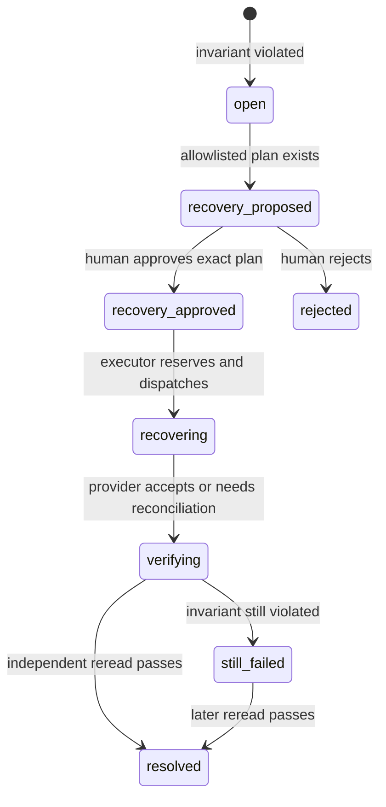

# FlowProof простым языком

Этот документ нужен для двух целей:

1. разобраться в проекте без предварительного знания FastAPI, React, n8n и сложных терминов;
2. дать другой нейросети проверенный источник для создания интерактивной HTML-шпаргалки.

Здесь описано только то, что есть в репозитории. Если документ расходится с кодом, источником истины является код и исполняемые проверки.

## 1. Что это вообще такое

FlowProof — это контролёр бизнес-результата автоматизаций.

Обычный workflow-движок, например n8n, хорошо отвечает на вопрос: «Все ли шаги сценария технически выполнились?» Но бизнесу обычно важен другой вопрос: «Появился ли нужный результат?»

Пример:

- n8n отправил счёт в бухгалтерскую систему;
- бухгалтерская система ответила `200 OK`;
- n8n покрасил execution в зелёный цвет;
- из-за сбоя счёт в бухгалтерской системе не сохранился;
- технически запрос был успешным, а бизнес-результата нет.

FlowProof не верит одному только успешному HTTP-ответу. Он отдельно перечитывает систему, где результат обязан существовать, и проверяет понятное правило: «Счёт с таким идентификатором, суммой и валютой существует или нет?»

## 2. Аналогия: доставка посылки

Представим курьера.

- n8n — диспетчер, который видит сообщение курьера «доставлено».
- Внешняя система — дом получателя.
- Business invariant — правило «посылка действительно у получателя».
- FlowProof — независимый контролёр, который просит подтверждение у получателя.
- Incident — зафиксированное расхождение: курьер сказал «доставлено», получатель говорит «посылки нет».
- Evidence — номер заказа, время, ответы систем и цепочка действий.
- Recovery plan — узкий план «повторно доставить только эту посылку».
- Human approval — решение ответственного человека, что повторная доставка безопасна.
- Independent reread — повторный звонок получателю после доставки.

FlowProof не отправляет весь маршрут курьера заново. Он исправляет только конкретный отсутствующий результат и только после одобрения.

## 3. Главная цепочка

```text
workflow создаёт событие
        ↓
FlowProof сохраняет его с idempotency key
        ↓
детерминированное правило проверяет ожидаемый результат
        ↓
независимый verifier читает внешнюю систему
        ↓
если результат неправильный — создаётся incident с evidence
        ↓
создаётся только разрешённый recovery plan
        ↓
человек изучает evidence и одобряет или отклоняет план
        ↓
executor выполняет одно узкое действие
        ↓
verifier снова независимо читает внешнюю систему
        ↓
incident становится resolved или остаётся still_failed
```

## 4. Почему проверки детерминированные

«Детерминированная» означает: одинаковые входные факты всегда дают одинаковый результат по заранее заданному правилу.

Например:

```text
ожидали 1 счёт
нашли 0 счетов
результат: нарушение exactly_once
```

Для установления нарушения не используется LLM. Нейросеть может помочь человеку прочитать evidence, но не может:

- объявить правило нарушенным;
- одобрить recovery;
- выполнить запись;
- отметить incident как resolved.

Это сделано специально: красивое AI-объяснение не является доказательством факта.

## 5. Какие правила умеет проверять FlowProof

### `ordering`

События должны идти в правильном порядке. Например, `invoice.approved` не должно появиться раньше `invoice.created`.

### `exactly_once`

Результат должен существовать ровно один раз. Ноль — потеря результата, два — дубликат.

### `eventually`

Результат может появиться не мгновенно, но обязан появиться до deadline. До deadline состояние ещё не считается ошибкой.

### `value_matches`

Значение во внешней системе должно совпадать с ожидаемым. Например, сумма и валюта счёта должны быть теми же.

### `external_assertion`

FlowProof обращается к внешнему verifier и проверяет авторитетное состояние, а не только локальные события.

## 6. Основные сущности

### Event

Безопасное бизнес-событие от workflow. Оно содержит тип события, entity, correlation, время, ограниченный payload и `idempotency_key`.

### Entity

Конкретный бизнес-объект: например, invoice `INV-123`. Все факты должны однозначно относиться к одной entity.

### Correlation

Идентификатор одной бизнес-цепочки. Он связывает события разных execution, но не имеет права смешивать разные entity.

### Policy и invariant

Машиночитаемое описание ожидаемого поведения. Policy содержит одно или несколько правил-invariants.

### Observation

Зафиксированный результат проверки: что именно читали, когда, какой ожидаемый и фактический результат получили.

### Incident

Объект, который создаётся при подтверждённом нарушении. Он содержит summary, ссылку на invariant, entity, evidence и текущее состояние.

### Recovery plan

Не произвольная команда, а заранее разрешённое узкое действие. В текущем golden path это `register_missing_invoice`.

### Recovery decision

Неизменяемая запись о том, кто, когда и для какой версии плана нажал approve, reject или revoke approval.

### Recovery attempt

Журнал технической попытки выполнения. Он создаётся до внешнего вызова, чтобы неопределённый ответ не привёл к слепому повтору.

### Evidence capsule

Очищенный архив доказательств: события, observations, incident, решения, попытки, хеши и Git-координаты. Его можно проверить офлайн.

## 7. Idempotency без магии

Idempotency означает: безопасное повторение одного и того же запроса не создаёт второй результат.

FlowProof использует ключи на двух уровнях:

1. Event ingestion: одинаковое событие с тем же ключом возвращает прежний результат. Если ключ тот же, а содержимое другое, сервер отвечает `409 Conflict`.
2. Side effect: recovery получает отдельный transport reservation, привязанный к конкретному плану и одобрению. Это защищает от двойной записи при retry или сетевой неопределённости.

Просто «проверить перед записью» недостаточно: два параллельных процесса могут одновременно увидеть отсутствие записи. Поэтому reservation хранится атомарно в базе.

## 8. Как возникает incident

1. API принимает событие и проверяет аутентификацию, размер, формат и idempotency key.
2. Событие сохраняется с provenance: откуда оно пришло и к какой correlation/entity относится.
3. Policy engine выбирает применимые invariants.
4. Если у правила есть deadline, durable scheduler создаёт задачу и не объявляет ошибку раньше времени.
5. External verifier независимо читает авторитетную систему.
6. Нарушение сохраняется как observation.
7. Service layer дедуплицирует incident: повторная одинаковая проверка не создаёт бесконечные копии.
8. Для поддерживаемого нарушения формируется recovery plan и его неизменяемый hash.

## 9. State machine incident

Упрощённая схема:



Точные внутренние состояния и допустимые переходы централизованы в backend и покрыты тестами. Важно не название каждого промежуточного состояния, а запреты:

- нельзя выполнить recovery без действующего human approval;
- нельзя подменить plan после approval, потому что проверяется hash;
- нельзя закрыть incident без независимого reread;
- `still_failed` не запускает компенсацию второй раз автоматически.

## 10. State machine recovery

Упрощённо recovery проходит следующие этапы:

1. `proposed` — FlowProof подготовил план, но ничего не записывает.
2. `approved` — человек одобрил точный план на ограниченное время.
3. `executing` — создан attempt и зарезервирован внешний вызов.
4. `verifying` — запись отправлена; теперь нужен независимый reread.
5. `verified` — постусловие выполнено.
6. `failed` или `needs_attention` — результат не подтверждён либо ответ неоднозначен; нужен оператор и reconciliation, а не blind retry.

Approval можно отклонить или отозвать. История решений append-only: старые записи не переписываются.

## 11. Из чего состоит проект

### Backend

`backend/src/flowproof/` — основная логика.

- `main*.py` — собирает FastAPI и HTTP routes. Handler проверяет запрос и вызывает сервисы; бизнес-логика не должна жить в handler.
- `service.py` — оркестрация доменного сценария: события, invariants, incidents и recovery.
- `policy.py` и связанные модули — загрузка и детерминированная оценка правил.
- `models.py` — таблицы SQLAlchemy.
- `schemas.py` — типизированные формы входных и выходных данных API.
- `identity.py` — люди, service accounts, credentials, sessions, scopes и audit.
- `scheduler.py` — обработка deadline-задач с lease и bounded retry.
- `accounting.py` и `provider_factory.py` — контракт verifier/recovery provider.
- `fixture_demo.py` — явно локальный `TEST_FIXTURE_ONLY` сценарий.
- `xero_demo.py` — feature-flagged PKCE и read-only qualification Xero Demo Company.
- `evidence*.py` — экспорт и офлайн-проверка evidence capsule.
- `alerts.py` и `observability.py` — операционные сигналы, health и metrics.

`backend/tests/` проверяет доменную логику, API, миграции, security boundaries, provider contracts и release contracts.

### Frontend

`frontend/src/` — React/Vite dashboard.

- `App.tsx` — основные экраны и operator journey.
- `api.ts` — единственное место для HTTP-вызовов UI.
- `types.ts` — TypeScript-типы ответов API.
- `styles.css` — responsive layout и визуальные состояния.

Frontend не решает, истинно ли нарушение. Он показывает данные backend и отправляет явно подтверждённые действия пользователя.

### n8n workflows

`workflows/` содержит четыре JSON-экспорта. Они структурно проверяются скриптом. n8n отправляет business events и вызывает разрешённые recovery endpoints, но не получает права одобрять recovery.

### Mock Accounting

`mock-accounting/` — маленький тестовый сервис с режимами сбоя. Режим `false_200` возвращает успешный HTTP-ответ и намеренно не сохраняет invoice. Это контролируемая поломка для воспроизводимого demo.

### Specs

`specs/` хранит:

- OpenAPI реального публичного API;
- YAML policies;
- provider contracts;
- JSON schemas evidence;
- redaction rules.

### Productization

`productization/windows/` содержит PowerShell-controller, manifest, Compose и builder Windows ZIP. Цель — локальный appliance поверх Docker Desktop, а не новый workflow editor.

### Scripts и release

`scripts/` — version, release, workflow, smoke, packaging и security gates. `release/STATUS.json` — текущая машиночитаемая граница доказательств. `NIGHTLY_REPORT.md` — исторический журнал, а не автоматический PASS текущего head.

## 12. База данных и миграции

Backend использует SQLAlchemy. Для локальных unit-тестов подходит SQLite; Compose использует PostgreSQL.

Alembic применяет только добавочные миграции. Для `0.6.0` текущий head остаётся `0010`: productization-overlay не требует новой схемы. Миграции нельзя заменять ручным редактированием уже существующей production-базы.

В базе сохраняются события, observations, incidents, plans, decisions, attempts, transport reservations, deadline jobs, identities и sanitized audit.

## 13. Основные группы API

Все публичные endpoints версионированы под `/api/v1`.

| Группа | Для чего |
| --- | --- |
| `/auth/*` | Login, logout, текущий principal и CSRF-сессия. |
| `/events` | Приём аутентифицированных business events. |
| `/correlations/{id}/evaluate` | Явный запуск детерминированной оценки. |
| `/entities/.../timeline` | Полная временная линия одной entity. |
| `/incidents` | Список и детали incidents. |
| `/recovery-plans/*` | Получение, approve/reject/revoke, execute, verify, reconcile, attempts и decisions. |
| `/deadline-jobs` | Операционный просмотр durable scheduler jobs. |
| `/identity/*` | Люди, service accounts, credentials, rotation и revocation. |
| `/security/audit` | Очищенный security audit. |
| `/demo/false-200/start` | Только явно включённый локальный `TEST_FIXTURE_ONLY`. |
| `/provider-connections/xero/*` | Только feature-flagged read-only PKCE/status/disconnect/qualification. |

Актуальная полная форма запросов находится в `specs/openapi.yaml` и на `/docs` запущенного API.

## 14. Люди, сервисы и права

Есть два принципиально разных типа principal:

- human principal входит через сессию, получает CSRF-защиту и может иметь право `recovery:approve`;
- service account получает ограниченный Bearer credential для n8n или другого процесса.

Производственный n8n credential ограничен scopes `events:write`, `recovery:execute` и `recovery:verify`. У него нет `recovery:approve`. Таким образом автоматизация не может сама одобрить собственное исправление.

Credentials имеют срок действия, rotation и revocation. Сырой токен показывается только при выдаче; в базе хранится защищённое представление.

## 15. Безопасность данных

- Payload имеет ограничения размера.
- Чувствительные поля редактируются по redaction rules.
- Неограниченные raw responses провайдера не сохраняются.
- Security audit не должен содержать пароли, Bearer tokens и cookies.
- Production требует надёжный token pepper и secure session cookie.
- Fixture flag запрещён в production даже при ошибочной настройке.
- Xero допускает только официальный HTTPS-origin и localhost callback.
- Xero access token хранится в памяти процесса, не записывается в базу и исчезает при disconnect/restart.
- Evidence содержит хеши и provenance, но его trust anchors должны приходить по независимому каналу.

## 16. Что делает demo false-200

1. Создаёт уникальные correlation и invoice ID.
2. Включает в Mock Accounting режим `false_200`.
3. Отправляет ту же безопасную последовательность событий, что и workflow.
4. Получает от mock транспортный success, хотя invoice не сохранён.
5. Ждёт deadline и evaluation scheduler.
6. Находит incident `missing_external_invoice`.
7. Создаёт временного human operator и одобряет recovery через session + CSRF.
8. Переключает Mock Accounting в `normal`.
9. Выполняет одну compensation.
10. Независимо перечитывает invoice.
11. Проверяет `recovery=verified`, `incident=resolved`, `invoice_count=1`.

Demo не удаляет evidence из FlowProof. Он очищает только непроизводственное in-memory состояние Mock Accounting.

## 17. Xero: что есть и чего нет

Есть:

- явный feature flag;
- browser PKCE без client secret;
- granular read scopes для invoices/settings;
- требование ровно одной Demo Company;
- проверка одного явно выбранного invoice;
- bounded sanitized qualification evidence;
- подтверждение, что provider mutation count равен нулю;
- token только в памяти.

Нет:

- production-сертификации;
- фонового refresh-token storage;
- записи или recovery в Xero;
- доказательства на реальном owner-authorized tenant в текущем релизе;
- права выбирать произвольную компанию или массово выгружать данные.

Поэтому правильная формулировка: «реализован и contract-tested read-only Xero Demo adapter; live provider evidence пока NOT VERIFIED».

## 18. Windows appliance

Windows-кандидат упаковывает controller, manifest, инструкции, Compose и необходимые локальные артефакты. Controller:

- проверяет Docker Desktop;
- загружает checksum-bound images;
- запускает FlowProof;
- помогает подключить существующий n8n через одноразовый API key;
- не сохраняет n8n API key;
- выполняет backup-first update только с разрешённой предыдущей версии;
- проверяет Alembic revision;
- не выдаёт unsigned ZIP за подписанный installer.

Границы: Docker Desktop остаётся внешней зависимостью, ZIP не подписан, независимый fresh-Windows прогон ещё не доказан.

## 19. Как проверять проект

Минимальные source gates:

```powershell
$env:PYTHONPATH = "backend/src"
python -m pytest backend/tests
python -m ruff check backend/src backend/tests
python scripts/check_version_consistency.py
python scripts/check_release_status.py
python scripts/validate_workflows.py

Set-Location frontend
npm ci
npm run lint
npm run build
```

Сильнее source gates только runtime proof:

- Compose false-200 demo;
- настоящий локальный n8n webhook lifecycle;
- approval-gated recovery;
- independent reread;
- ровно один invoice;
- распаковка и проверка Windows asset;
- security scans;
- публичный анонимный clone exact release tag.

Локальный PASS не доказывает GitHub Actions, fresh Windows, реальный Xero или production.

## 20. Как рассказать о проекте на собеседовании

Короткая версия:

> Я сделал слой outcome assurance для n8n. Он ловит ситуацию, когда execution зелёный, но бизнес-результат отсутствует. Проверки детерминированные, каждый incident содержит evidence, recovery ограничен allowlist и idempotency, требует human approval и закрывается только после независимого reread.

Если спрашивают «зачем не хватило retry?»:

> Retry повторяет техническую операцию, но не знает, принят ли первый запрос. Без идемпотентности он может создать дубль. FlowProof сначала выясняет фактическое состояние, привязывает recovery к конкретному incident и approval, резервирует side effect и после него проверяет postcondition.

Если спрашивают «зачем база?»:

> Дедлайны, incidents, approvals и attempts должны переживать restart. Иначе после падения невозможно доказать, был ли внешний вызов и можно ли его повторять.

Если спрашивают «почему человек?»:

> Автоматическое исправление может увеличить ущерб. FlowProof показывает evidence и blast radius, но решение о записи принимает человек с отдельным scope.

Если спрашивают «где AI?»:

> AI намеренно находится только в объяснительном слое. Истину определяют воспроизводимые правила и authoritative read.

Если спрашивают «что production-ready?»:

> Я разделяю доказательства. Доменное ядро, security boundaries и локальный runtime проверяются автоматически. Реальный Xero, fresh Windows, code signing и конкретная инфраструктура остаются отдельными external gates; я не называю fixture production-интеграцией.

## 21. Вопросы, которые полезно разобрать самому

1. Чем transport success отличается от business success?
2. Почему `200 OK` недостаточно?
3. Где именно используется idempotency key?
4. Что произойдёт при двух параллельных recovery requests?
5. Почему approval привязан к plan hash и incident state?
6. Что делать, если provider принял запись, но connection оборвался до ответа?
7. Почему `still_failed` не запускает запись повторно?
8. Какие данные можно помещать в evidence, а какие нельзя?
9. Почему service account не может approve recovery?
10. Чем unit test, Docker smoke, GitHub Actions и real-provider evidence доказывают разные вещи?

## 22. Глоссарий

| Термин | Простое объяснение |
| --- | --- |
| Workflow | Последовательность автоматических шагов. |
| Execution | Один технический запуск workflow. |
| Business outcome | Результат, ради которого запускался workflow. |
| False success | Технический успех без нужного бизнес-результата. |
| Invariant | Проверяемое правило, которое должно оставаться истинным. |
| Authoritative system | Система, чьё состояние считается главным источником истины. |
| Verifier | Компонент, который независимо читает authoritative system. |
| Incident | Зафиксированное подтверждённое нарушение. |
| Evidence | Машиночитаемые факты, объясняющие вывод и действия. |
| Correlation ID | Связка событий одной бизнес-цепочки. |
| Entity | Конкретный бизнес-объект, например один invoice. |
| Idempotency key | Ключ, не позволяющий одному действию случайно выполниться дважды. |
| Side effect | Изменение внешнего мира, например создание invoice. |
| Recovery | Узкое контролируемое исправление результата. |
| Compensation | Конкретное разрешённое действие восстановления. |
| Human-in-the-loop | Обязательное решение человека внутри автоматического процесса. |
| Plan hash | Отпечаток плана, защищающий одобренное содержимое от подмены. |
| Deadline | Момент, после которого отсутствие eventual-result считается ошибкой. |
| Lease | Временное право одного worker обрабатывать задачу. |
| Reread | Повторное независимое чтение результата после записи. |
| Reconciliation | Разбор неоднозначного внешнего результата без слепого повторения. |
| Fixture | Контролируемая тестовая система, не production provider. |
| PKCE | OAuth-механизм для входа пользователя без хранения client secret в приложении. |
| Scope | Ограниченное право credential на конкретное действие. |
| Provenance | Информация о происхождении факта или evidence. |

## 23. Где искать актуальную истину

- Текущая release-классификация: `release/STATUS.json`.
- Человеческое объяснение статуса: `docs/RELEASE_STATUS.md`.
- Реальные ограничения: `docs/KNOWN_LIMITATIONS.md`.
- OpenAPI: `specs/openapi.yaml`.
- Policies: `specs/policies/`.
- Provider contracts: `specs/providers/`.
- Исполняемые доказательства: `backend/tests/` и `scripts/`.
- Исторический журнал: `NIGHTLY_REPORT.md`; он не заменяет свежий прогон.

## 24. Самая важная мысль

FlowProof не обещает, что автоматизация никогда не сломается. Он делает поломку наблюдаемой, доказуемой и управляемой: обнаруживает неправильный бизнес-результат, показывает факты, ограничивает исправление, требует ответственность человека и проверяет итог независимо.
